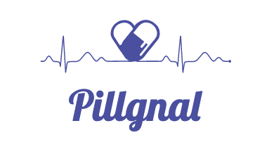

# 목소리로 알려 주는 스마트 복약 관리 서비스 'Pillgnal' 💊

### 구성원
**FE** 김재성 / 윤혜민 / 조성국
 
**BE** 김재승 / 엄재웅

### 기술 스택
**FE** Vue.js, Vuetify, Bootstrap
 
**BE** SpringBoot, JPA, Docker, Gradle, MariaDB, nginx
 
**ETC** Jira, Mattermost, Discord, GitLab
 

### 설치
    build.gradle -> dependencies
    implementation group: 'com.google.cloud', name: 'google-cloud-vision', version: '1.101.1'
    implementation 'org.springframework.cloud:spring-cloud-gcp-starter-storage'

 

## Pillgnal? 
> Pill (알약) + Signal(신호)를 합친 말로, 약을 먹어야할 시간과 복약정보를 알려주는 웹 서비스입니다.

 

## 기획배경
* 복용 시간을 까먹었을 때
* 잘못된 약을 섭취했을 때
* 부모님이 약을 잘 드시는지 궁금할 때

🤔 **불편을 개선할 수 있는 서비스가 필요하지 않을까?**

 

## Logo & Character
#### 필그널 main 로고
> 알약 + 신호를 잘 나타내는 메인 로고입니다.

#### 필그널 캐릭터 '필구'
> 필구가 복약 핵심 정보를 알려줍니다.

 

## 기능설명
### 1. 처방전 스캐닝
* 약봉투, 처방전을 사진으로 찍으면 자동으로 복약정보를 저장해줍니다.

### 2. 복약 알림
* 인식한 내용을 바탕으로 날짜, 시간에 따라 약 먹을 시간에 알림을 줍니다.

### 3. 처방전 리스트
* 처방 받은 목록을 보여줍니다.
* 처방 받은 약에 대한 정보도 알 수 있습니다.

### 4. 가족 연결
* 가족과 연결하면 구성원들의 복약 상태를 확인할 수 있습니다.

### 5. 약 정보 검색
* 궁금한 약을 사진을 찍기만 하면, 약학 정보원 API를 사용해 검색해줍니다.

 

## 와이어프레임

 

https://www.figma.com/proto/7ax4XD2rl2tCJ1rXzvgtbX/pillgnal-prototype-ver.1?node-id=1%3A189&scaling=min-zoom
 

## 진행 상황
* 기능 정의
* 프로토타입 완성

#### 기능구현
> OCR로 약 구분 표시(약에 적힌 글씨 ) 추출 가능

 

## 앞으로의 계획
* 약의 모양 (사각형/ 원형 /타원형 등) 인식  
* 약의 색상 인식 (하양, 노랑, 주황 등)  
* 약의 제형 (정제류 / 캡슐형)

#### 아쉬운점
- 색상인식 까지는 어렵지 않을 것으로 보이나, 약의 모양을 인식하기 위한 충분한 Dataset을 찾아야 정확한 모델링이 가능할 것으로 보임
  - 현재 Kaggle등의 사이트에서 비슷한 데이터를 찾았으나 다소 아쉬움.

